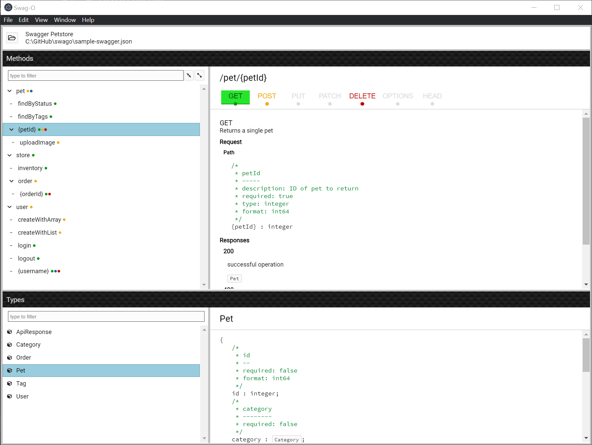

# Swag-O

A useful viewer of Swagger files.

# Installation

Install the application by downloading the setup from the latest version in the `built/` folder.

> This binary is not digitally signed, so you'll need to grant permission for the setup to install.

Alternatively you can download the source and build the setup locally:

1. Prerequisites Node (v12 or later) with NPM (v6 or later).
2. `npm install`
3. `npm run full`

# Why does this exist?

The Swagger open API specification is an amazing and popular way to describe APIs. The folks at swagger.io have done a great job with the specification standardization and the tools for creating swagger files and generating client code in multiple lanuages. However, the Swagger UI viewer leaves a lot to be desired. It is just a pretty display of the entire swagger files.

Mildly complex or larger swagger files are painful to navigate. Developers must:

- spend excessive time scrolling to find items (especially since items are ordered by the swagger file, not alphabetically)
- scrutinize the method paths to distinguish restful hierarchy
- repeatedly precision click to expand and view related methods and types
- jump to the swagger JSON to search by text

So I built this little tool to make moving around the swagger easier. I hope you like it.

# Features

- Support Swagger Open API 2.0 documents
- Simultaneously inspect methods and types
- Easily navigate to methods by their path
- At-a-glance indication of the operations (e.g. GET, POST, PUT) available on each method
- Information presented as ode and code comments for select and copy into your code.
- Follow references to view types with a single click
- Filter to methods and types of interest
- Select and copy code directly into your app

# Technology Stack

- Shout out to [swagger-parser](https://apitools.dev/swagger-parser/).
- Typescript (language)
- React and Styled Components (user interface)
- Recoil (state management)
- Webpack (build and bundling)
- Electron (client)

# Releases

## 1.1.0

Initial public release

## 1.1.1

- Updated to latest version of @geoffcox/react-splitter
- Updated to resolve npm audit security issues.
